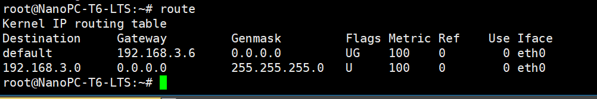
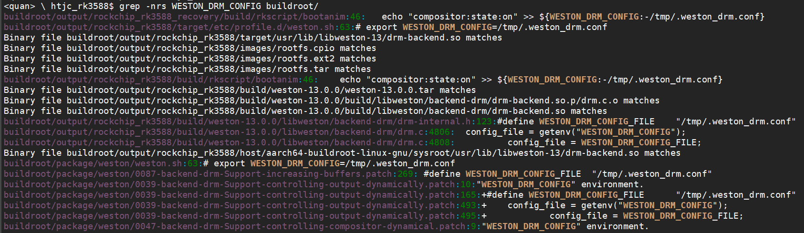

# HTJC_Debug_Note

[TOC]


## board config

### kernel


## USB

adb开关

```shell
BR2_PACKAGE_ANDROID_TOOLS_ADBD
```

配置

```shell
echo usb_adb_en > /tmp/.usb_config
/etc/init.d/S50usbdevice.sh restart
```


### RTC

```
date          //修改系统时钟，具体命令使用可以man下
hwclock -s    //将硬件时间同步到系统时间
hwclock -w    //将系统时间同步到硬件时间
timedatectl   //显示系统时间等
```


```shell
root@rk3588:/# hwclock --show
Mon Dec 23 08:31:53 2165  0.000000 seconds
```

设置时间，同步到硬件RTC

```
root@rk3588:/# date -s "2024-07-07 16:22:33"
Sun Jul  7 16:22:33 UTC 2024
root@rk3588:/# hwclock -w
root@rk3588:/# hwclock -r
Sun Jul  7 16:23:26 2024  0.000000 seconds
root@rk3588:/#

```


### MS9601

```shell
cat /sys/devices/platform/feab0000.i2c/i2c-3/3-0029/cur_port
cat /sys/devices/platform/feab0000.i2c/i2c-3/3-0029/update_time
cat /sys/devices/platform/feab0000.i2c/i2c-3/3-0029/auto_update
cat /sys/devices/platform/feab0000.i2c/i2c-3/3-0029/setted_port
cat /sys/devices/platform/feab0000.i2c/i2c-3/3-0029/debug
echo 1 > /sys/devices/platform/feab0000.i2c/i2c-3/3-0029/debug
echo 0 > /sys/devices/platform/feab0000.i2c/i2c-3/3-0029/debug
```


### HDMI IN

获取HDMI 信息

```shell
root@rk3588-buildroot:/# v4l2-ctl -d /dev/video0 --query-dv-timings
        Active width: 1920
        Active height: 1080
        Total width: 2200
        Total height: 1125
        Frame format: progressive
        Polarities: -vsync -hsync
        Pixelclock: 148352000 Hz (59.94 frames per second)
        Horizontal frontporch: 88
        Horizontal sync: 44
        Horizontal backporch: 148
        Vertical frontporch: 4
        Vertical sync: 5
        Vertical backporch: 36
        Standards:
        Flags:
root@rk3588-buildroot:/#
```

### 查看图像格式

```shell
root@rk3588:/opt# v4l2-ctl -d /dev/video0 --get-fmt-video
Format Video Capture Multiplanar:
        Width/Height      : 1920/1080
        Pixel Format      : 'NV24' (Y/CbCr 4:4:4)
        Field             : None
        Number of planes  : 1
        Flags             : premultiplied-alpha, 0x000000fe
        Colorspace        : SMPTE 170M
        Transfer Function : Unknown (0x000000b8)
        YCbCr/HSV Encoding: Unknown (0x000000ff)
        Quantization      : Default
        Plane 0           :
           Bytes per Line : 1920
           Size Image     : 6220800
```


HDMI IN 连接状态

```shell
cat /sys/class/hdmirx/hdmirx/status
```

> 接了MS9601, 一直是连接的状态


### HDMI IN 运行PID

```shell
root@rk3588:/# ps -aux | grep Camera
root      1138  4.8  1.0 1521344 81496 pts/0   Sl+  01:35   0:00 ./Camera -D /dev/video0 -s 1920x1080
root      1174  0.0  0.0   3048  1060 pts/1    S+   01:35   0:00 grep Camera
```


## Network

### dhcpcd

```log
Jul 22 23:51:59 rk3588 daemon.info dhcpcd[645]: eth0: IAID c7:24:b1:a9                                                                                 Jul 22 23:52:00 rk3588 daemon.info dhcpcd[645]: eth0: soliciting an IPv6 router                                                                        Jul 22 23:52:01 rk3588 daemon.info dhcpcd[645]: eth0: soliciting a DHCP lease                                                                          Jul 22 23:52:06 rk3588 daemon.info dhcpcd[645]: eth0: probing for an IPv4LL address                                                                    Jul 22 23:52:11 rk3588 daemon.info dhcpcd[645]: eth0: using IPv4LL address 169.254.81.110                                                              Jul 22 23:52:11 rk3588 daemon.info dhcpcd[645]: eth0: adding route to 169.254.0.0/16
Jul 22 23:52:11 rk3588 daemon.info dhcpcd[645]: eth0: adding default route
Jul 22 23:52:11 rk3588 daemon.notice ntpd[666]: ntpd 4.2.8p15@1.3728-o Mon Jul 22 02:14:48 UTC 2024 (1): Starting
Jul 22 23:52:11 rk3588 daemon.notice ntpd[666]: Command line: /usr/sbin/ntpd -g -p /var/run/ntpd.pid
Jul 22 23:52:11 rk3588 daemon.notice ntpd[666]: ----------------------------------------------------                                                   Jul 22 23:52:11 rk3588 daemon.notice ntpd[666]: ntp-4 is maintained by Network Time Foundation,                                                        Jul 22 23:52:11 rk3588 daemon.notice ntpd[666]: Inc. (NTF), a non-profit 501(c)(3) public-benefit
Jul 22 23:52:11 rk3588 daemon.notice ntpd[666]: corporation.  Support and training for ntp-4 are
Jul 22 23:52:11 rk3588 daemon.notice ntpd[666]: available at https://www.nwtime.org/support
```


## Display


### HDMI IN 输入支持像素格式

> kernel\drivers\media\platform\rockchip\hdmirx\rk_hdmirx.c
>
> BGR24, NV16, NV24, NV12

```c
static void hdmirx_get_pix_fmt(struct rk_hdmirx_dev *hdmirx_dev)
{
	u32 val;
	int timeout = 10;
	struct v4l2_device *v4l2_dev = &hdmirx_dev->v4l2_dev;

try_loop:
	val = hdmirx_readl(hdmirx_dev, DMA_STATUS11);
	hdmirx_dev->pix_fmt = val & HDMIRX_FORMAT_MASK;

	switch (hdmirx_dev->pix_fmt) {
	case HDMIRX_RGB888:
		hdmirx_dev->cur_fmt_fourcc = V4L2_PIX_FMT_BGR24;
		break;
	case HDMIRX_YUV422:
		hdmirx_dev->cur_fmt_fourcc = V4L2_PIX_FMT_NV16;
		break;
	case HDMIRX_YUV444:
		hdmirx_dev->cur_fmt_fourcc = V4L2_PIX_FMT_NV24;
		break;
	case HDMIRX_YUV420:
		hdmirx_dev->cur_fmt_fourcc = V4L2_PIX_FMT_NV12;
		break;

	default:
		if (timeout-- > 0) {
			usleep_range(200 * 1000, 200 * 1010);
			v4l2_err(v4l2_dev, "%s: get format failed, read again!\n", __func__);
			goto try_loop;
		}
		hdmirx_dev->pix_fmt = HDMIRX_RGB888;
		hdmirx_dev->cur_fmt_fourcc = V4L2_PIX_FMT_BGR24;
		v4l2_err(v4l2_dev,
			"%s: err pix_fmt: %d, set RGB888 as default\n",
			__func__, hdmirx_dev->pix_fmt);
		break;
	}
```


- 查看drm连接状态

```shell
root@rk3588-buildroot:/# cat sys/class/drm/card0-HDMI-A-1/status
connected
```

- 查看EDID信息

```shell
root@rk3588-buildroot:/# cat /sys/class/drm/card0-HDMI-A-1/edid  > data/edid
root@rk3588-buildroot:/# hexdump -C data/edid
00000000  00 ff ff ff ff ff ff 00  25 e3 ff ff 00 00 00 00  |........%.......|
00000010  18 20 01 03 80 3c 19 78  2a 48 d5 aa 51 46 af 24  |. ...<.x*H..QF.$|
00000020  0a 50 54 b3 0c 00 01 01  81 c0 81 40 81 80 95 00  |.PT........@....|
00000030  a9 c0 b3 00 d1 c0 0a 48  00 a0 a0 38 32 40 30 20  |.......H...82@0 |
00000040  35 00 59 fd 20 00 00 1a  00 00 00 fd 00 30 3c 35  |5.Y. ........0<5|
00000050  5e 3c 00 0a 20 20 20 20  20 20 00 00 00 fc 00 32  |^<..      .....2|
00000060  36 43 31 46 00 20 20 20  20 20 20 20 00 00 00 ff  |6C1F.       ....|
00000070  00 30 30 30 30 30 30 30  30 30 30 30 30 31 01 a6  |.0000000000001..|
00000080  02 03 2f f1 49 01 02 03  04 1f 90 11 12 13 23 09  |../.I.........#.|
00000090  1f 07 83 01 00 00 67 03  0c 00 10 00 18 42 67 d8  |......g......Bg.|
000000a0  5d c4 01 78 c0 01 68 1a  00 00 01 01 30 3c ed 16  |]..x..h.....0<..|
000000b0  37 80 a0 70 38 32 40 30  40 35 00 59 fd 20 00 00  |7..p82@0@5.Y. ..|
000000c0  1a 00 00 00 00 00 00 00  00 00 00 00 00 00 00 00  |................|
000000d0  00 00 00 00 00 00 00 00  00 00 00 00 00 00 00 00  |................|
*
000000f0  00 00 00 00 00 00 00 00  00 00 00 00 00 00 00 ba  |................|
00000100

```

- 查看`hdmi`输出使能状态：

```shell
cat /sys/class/drm/card0-HDMI-A-1/enabled
```

- dsc mode 和 tmds mode

  > DSC (Digital Serial Interface) 和 TMDS (Transition Minimized Differential Signaling) 是两种不同的数字视频传输技术。
  >
  > 1. **DSC (Digital Serial Interface)**:
  >    - DSC 是一种用于传输高分辨率视频信号的串行接口技术。
  >    - 它通过压缩数据来减少所需的传输带宽，从而可以在现有的接口上传输更高分辨率的视频。
  >    - DSC 技术允许在单根电缆上传输高达 8K 分辨率的视频信号。
  >    - 它被设计用于连接显示器和图形处理器，例如在电视、监视器和图形卡中。
  > 2. **TMDS (Transition Minimized Differential Signaling)**:
  >    - TMDS 是一种用于高速串行数据传输的信号编码技术。
  >    - 它通过最小化信号转换来减少电磁干扰（EMI），从而提高信号的完整性和可靠性。
  >    - TMDS 通常用于 DVI (Digital Visual Interface) 和 HDMI (High-Definition Multimedia Interface) 接口。
  >    - 它支持多种分辨率和刷新率，包括高清和超高清视频格式。
  >
  > 两者的主要区别在于它们的应用领域和传输方式。DSC 主要关注于高分辨率视频的传输，而 TMDS 更多地被用于通用的高速串行数据传输，特别是在视频接口中。


- Established Timings`其定义在`drivers/gpu/drm/drm_edid.c`文件的`edid_est_modes`数组中：

```c
static const struct drm_display_mode edid_est_modes[] = {
        { DRM_MODE("800x600", DRM_MODE_TYPE_DRIVER, 40000, 800, 840,
                   968, 1056, 0, 600, 601, 605, 628, 0,
                   DRM_MODE_FLAG_PHSYNC | DRM_MODE_FLAG_PVSYNC) }, /* 800x600@60Hz 支持 */
        { DRM_MODE("800x600", DRM_MODE_TYPE_DRIVER, 36000, 800, 824,
                   896, 1024, 0, 600, 601, 603,  625, 0,
                   DRM_MODE_FLAG_PHSYNC | DRM_MODE_FLAG_PVSYNC) }, /* 800x600@56Hz 支持 */
        { DRM_MODE("640x480", DRM_MODE_TYPE_DRIVER, 31500, 640, 656,
                   720, 840, 0, 480, 481, 484, 500, 0,
                   DRM_MODE_FLAG_NHSYNC | DRM_MODE_FLAG_NVSYNC) }, /* 640x480@75Hz 支持 */
        { DRM_MODE("640x480", DRM_MODE_TYPE_DRIVER, 31500, 640, 664,
                   704,  832, 0, 480, 489, 492, 520, 0,
                   DRM_MODE_FLAG_NHSYNC | DRM_MODE_FLAG_NVSYNC) }, /* 640x480@72Hz 支持 */
        { DRM_MODE("640x480", DRM_MODE_TYPE_DRIVER, 30240, 640, 704,
                   768,  864, 0, 480, 483, 486, 525, 0,
                   DRM_MODE_FLAG_NHSYNC | DRM_MODE_FLAG_NVSYNC) }, /* 640x480@67Hz */
        { DRM_MODE("640x480", DRM_MODE_TYPE_DRIVER, 25175, 640, 656,
                   752, 800, 0, 480, 490, 492, 525, 0,
                   DRM_MODE_FLAG_NHSYNC | DRM_MODE_FLAG_NVSYNC) }, /* 640x480@60Hz 支持  */
        { DRM_MODE("720x400", DRM_MODE_TYPE_DRIVER, 35500, 720, 738,
                   846, 900, 0, 400, 421, 423,  449, 0,
                   DRM_MODE_FLAG_NHSYNC | DRM_MODE_FLAG_NVSYNC) }, /* 720x400@88Hz */
        { DRM_MODE("720x400", DRM_MODE_TYPE_DRIVER, 28320, 720, 738,
                   846,  900, 0, 400, 412, 414, 449, 0,
                   DRM_MODE_FLAG_NHSYNC | DRM_MODE_FLAG_PVSYNC) }, /* 720x400@70Hz */
        { DRM_MODE("1280x1024", DRM_MODE_TYPE_DRIVER, 135000, 1280, 1296,
                   1440, 1688, 0, 1024, 1025, 1028, 1066, 0,
                   DRM_MODE_FLAG_PHSYNC | DRM_MODE_FLAG_PVSYNC) }, /* 1280x1024@75Hz 支持 */
        { DRM_MODE("1024x768", DRM_MODE_TYPE_DRIVER, 78750, 1024, 1040,
                   1136, 1312, 0,  768, 769, 772, 800, 0,
                   DRM_MODE_FLAG_PHSYNC | DRM_MODE_FLAG_PVSYNC) }, /* 1024x768@75Hz 支持 */
        { DRM_MODE("1024x768", DRM_MODE_TYPE_DRIVER, 75000, 1024, 1048,
                   1184, 1328, 0,  768, 771, 777, 806, 0,
                   DRM_MODE_FLAG_NHSYNC | DRM_MODE_FLAG_NVSYNC) }, /* 1024x768@70Hz 支持 */
        { DRM_MODE("1024x768", DRM_MODE_TYPE_DRIVER, 65000, 1024, 1048,
                   1184, 1344, 0,  768, 771, 777, 806, 0,
                   DRM_MODE_FLAG_NHSYNC | DRM_MODE_FLAG_NVSYNC) }, /* 1024x768@60Hz 支持 */
        { DRM_MODE("1024x768i", DRM_MODE_TYPE_DRIVER,44900, 1024, 1032,
                   1208, 1264, 0, 768, 768, 776, 817, 0,
                   DRM_MODE_FLAG_PHSYNC | DRM_MODE_FLAG_PVSYNC | DRM_MODE_FLAG_INTERLACE) }, /* 1024x768@43Hz */
        { DRM_MODE("832x624", DRM_MODE_TYPE_DRIVER, 57284, 832, 864,
                   928, 1152, 0, 624, 625, 628, 667, 0,
                   DRM_MODE_FLAG_NHSYNC | DRM_MODE_FLAG_NVSYNC) }, /* 832x624@75Hz */
        { DRM_MODE("800x600", DRM_MODE_TYPE_DRIVER, 49500, 800, 816,
                   896, 1056, 0, 600, 601, 604,  625, 0,
                   DRM_MODE_FLAG_PHSYNC | DRM_MODE_FLAG_PVSYNC) }, /* 800x600@75Hz 支持 */
        { DRM_MODE("800x600", DRM_MODE_TYPE_DRIVER, 50000, 800, 856,
                   976, 1040, 0, 600, 637, 643, 666, 0,
                   DRM_MODE_FLAG_PHSYNC | DRM_MODE_FLAG_PVSYNC) }, /* 800x600@72Hz 支持 */
        { DRM_MODE("1152x864", DRM_MODE_TYPE_DRIVER, 108000, 1152, 1216,
                   1344, 1600, 0,  864, 865, 868, 900, 0,
                   DRM_MODE_FLAG_PHSYNC | DRM_MODE_FLAG_PVSYNC) }, /* 1152x864@75Hz */
};
```

- `Standard Timings`其定义在`drivers/gpu/drm/drm_edid.c`文件的`drm_dmt_modes`数组中，由于数组元素比较多，这里就不一一列出了，只列出部分：

  ```c
  static const struct drm_display_mode drm_dmt_modes[] = {
  	/* 0x55 - 1280x720@60Hz */
  	{ DRM_MODE("1280x720", DRM_MODE_TYPE_DRIVER, 74250, 1280, 1390,
  			   1430, 1650, 0, 720, 725, 730, 750, 0,
  			   DRM_MODE_FLAG_PHSYNC | DRM_MODE_FLAG_PVSYNC) },
  	/* 0x23 - 1280x1024@60Hz */
  	{ DRM_MODE("1280x1024", DRM_MODE_TYPE_DRIVER, 108000, 1280, 1328,
  			   1440, 1688, 0, 1024, 1025, 1028, 1066, 0,
  			   DRM_MODE_FLAG_PHSYNC | DRM_MODE_FLAG_PVSYNC) },
  	/* 0x2f - 1440x900@60Hz */
  	{ DRM_MODE("1440x900", DRM_MODE_TYPE_DRIVER, 106500, 1440, 1520,
  			   1672, 1904, 0, 900, 903, 909, 934, 0,
  			   DRM_MODE_FLAG_NHSYNC | DRM_MODE_FLAG_PVSYNC) },
  	/* 0x53 - 1600x900@60Hz */
  	{ DRM_MODE("1600x900", DRM_MODE_TYPE_DRIVER, 108000, 1600, 1624,
  			   1704, 1800, 0, 900, 901, 904, 1000, 0,
  			   DRM_MODE_FLAG_PHSYNC | DRM_MODE_FLAG_PVSYNC) },
  	/* 0x3a - 1680x1050@60Hz */
  	{ DRM_MODE("1680x1050", DRM_MODE_TYPE_DRIVER, 146250, 1680, 1784,
  			   1960, 2240, 0, 1050, 1053, 1059, 1089, 0,
  			   DRM_MODE_FLAG_NHSYNC | DRM_MODE_FLAG_PVSYNC) },
  	/* 0x52 - 1920x1080@60Hz */
  	{ DRM_MODE("1920x1080", DRM_MODE_TYPE_DRIVER, 148500, 1920, 2008,
  			   2052, 2200, 0, 1080, 1084, 1089, 1125, 0,
  			   DRM_MODE_FLAG_NHSYNC | DRM_MODE_FLAG_NVSYNC) },
  	/* 0x45 - 1920x1200@60Hz */
  	{ DRM_MODE("1920x1200", DRM_MODE_TYPE_DRIVER, 193250, 1920, 2056,
  			   2256, 2592, 0, 1200, 1203, 1209, 1245, 0,
  			   DRM_MODE_FLAG_NHSYNC | DRM_MODE_FLAG_PVSYNC) },
      ......
  }
  ```

  


## Buildroot

echo "output:HDMI-A-1:mode=1920x1080" > /tmp/.weston_drm.conf

### 休眠唤醒


### 网络

#### 路由表

- 增加默认

  ```shell
  route  add default gw 192.168.3.0 dev eth0
   
  root@rk3588:/# route -n
  Kernel IP routing table
  Destination     Gateway         Genmask         Flags Metric Ref    Use Iface
  0.0.0.0         192.168.3.6     0.0.0.0         UG    0      0        0 eth0
  0.0.0.0         0.0.0.0         0.0.0.0         U     1001002 0        0 eth0
  169.254.0.0     0.0.0.0         255.255.0.0     U     1002   0        0 eth0
  192.168.3.0     0.0.0.0         255.255.255.0   U     0      0        0 eth0
  ```

  

### 查看默认路由表

```shell
root@htjc:/# ip route  show default
default dev eth1 scope link src 169.254.81.110 metric 1001002
```

```shell
ip route add 192.168.3.10 via 192.168.3.1
root@htjc:/# route
Kernel IP routing table
Destination     Gateway         Genmask         Flags Metric Ref    Use Iface
default         *               0.0.0.0         U     1001002 0        0 eth0
169.254.0.0     *               255.255.0.0     U     1002   0        0 eth0
192.168.3.0     *               255.255.255.0   U     0      0        0 eth0
192.168.3.10    192.168.3.1     255.255.255.255 UGH   0      0        0 eth0
```


### overlays

1. 修改你的board配置文件（位于`board/<vendor>/<board>/<board>.mk`），添加以下两行代码：

   ```
   BR2_ROOTFS_POST_BUILD_SCRIPT=$(BR2_EXTERNAL_BOARD_PATH)/files/my_script.sh
   BR2_ROOTFS_OVERLAY=$(BR2_EXTERNAL_BOARD_PATH)/overlay/
   ```

   `BR2_ROOTFS_POST_BUILD_SCRIPT`指定了在构建完rootfs之后要运行的脚本，而`BR2_ROOTFS_OVERLAY`则指定了额外覆盖到rootfs上的文件夹路径。

## weston


- WESTON_DRM_CONFIG




## QT app

### 运行代码指定drm

```shell
./animatedtiles --platform linuxfb
```

QT error

```txt
qt.qpa.wayland: Wayland does not support QWindow::requestActivate()
```

```txt
root@rk3588:/opt/demo# ./Camera -D /dev/video0 -s 1920x1080
QStandardPaths: runtime directory '/var/run' is not a directory, but a symbolic link to a directory permissions 0755 owned by UID 0 GID 0
setting OutPacketbuffer max size to 2000000 (bytes)
Server has been created on port 8554
Creating media session for each transcoder
Adding media session for camera:
Starting to capture and encoder video from video Unicast media subsession with UDP datagram size of 1500
"/dev/video0" 0 0 1920 1080 -1
"/dev/video0" "rk_hdmirx"
	and estimated bitrate of 1440 (kbps) is createdPlay the stream of the , url: rtsp://0.0.0.0:8554/unicastUsing mplane plugin for capture
Using mplane plugin for capture
arm_release_ver: g13p0-01eac0, rk_so_ver: 6
qt.qpa.wayland: Wayland does not support QWindow::requestActivate()
QRect(0,0 807x608)
Unable to query the parameter info: QCameraImageProcessingControl::WhiteBalancePreset : "Invalid argument"
Unable to query the parameter info: QCameraImageProcessingControl::ColorTemperature : "Invalid argument"
Unable to query the parameter info: QCameraImageProcessingControl::ContrastAdjustment : "Invalid argument"
Unable to query the parameter info: QCameraImageProcessingControl::SaturationAdjustment : "Invalid argument"
Unable to query the parameter info: QCameraImageProcessingControl::BrightnessAdjustment : "Invalid argument"
Unable to query the parameter info: QCameraImageProcessingControl::SharpeningAdjustment : "Invalid argument"
CameraBin error: "Internal data stream error."
[   71.849193] fdee0000.hdmirx-controller: stream start stopping
[   71.853806] fdee0000.hdmirx-controller: stream stopping finished
displayCameraError "Internal data stream error."
root@rk3588:/opt/demo#

```


## 色相，饱和度调整

获取当前的屏幕种类和 modetest id

```shell
root@rk3588:/# modetest -M rockchip
Encoders:
id      crtc    type    possible crtcs  possible clones
194     0       Virtual 0x0000000f      0x00000001
196     68      TMDS    0x00000001      0x00000002
210     128     DSI     0x00000008      0x00000004

Connectors:
id      encoder status          name            size (mm)       modes   encoders
197     196     connected       HDMI-A-1        600x250         11      196
  modes:
        index name refresh (Hz) hdisp hss hse htot vdisp vss vse vtot
  #0 1920x1080 60.00 1920 2008 2052 2200 1080 1084 1089 1125 148500 flags: phsync, pvsync; type: driver
  #1 1920x1080 50.00 1920 2448 2492 2640 1080 1084 1089 1125 148500 flags: phsync, pvsync; type: driver
  #2 1600x900 60.00 1600 1624 1704 1800 900 901 904 1000 108000 flags: phsync, pvsync; type: driver
  #3 1280x1024 60.02 1280 1328 1440 1688 1024 1025 1028 1066 108000 flags: phsync, pvsync; type: driver
  #4 1280x960 60.00 1280 1376 1488 1800 960 961 964 1000 108000 flags: phsync, pvsync; type: driver
  #5 1280x720 60.00 1280 1390 1430 1650 720 725 730 750 74250 flags: phsync, pvsync; type: driver
  #6 1280x720 50.00 1280 1720 1760 1980 720 725 730 750 74250 flags: phsync, pvsync; type: driver
  #7 1024x768 70.07 1024 1048 1184 1328 768 771 777 806 75000 flags: nhsync, nvsync; type: driver
  #8 800x600 56.25 800 824 896 1024 600 601 603 625 36000 flags: phsync, pvsync; type: driver
  #9 720x576 50.00 720 732 796 864 576 581 586 625 27000 flags: nhsync, nvsync; type: driver
  #10 720x480 59.94 720 736 798 858 480 489 495 525 27000 flags: nhsync, nvsync; type: driver
CRTCs:
id      fb      pos     size
68      213     (0,0)   (1920x1080)
  #0 1920x1080 60.00 1920 2008 2052 2200 1080 1084 1089 1125 148500 flags: phsync, pvsync; type: driver
  props:
```

简略信息

```shell
root@rk3588:/# modetest -M rockchip | cut -f1 | grep -E ^[0-9A-Z]\|id
Encoders:
id
194
196
210
Connectors:
id
197
211
CRTCs:
id
68
88
108
128
Planes:
id
54
74
94
114
134
148
162
176
Frame buffers:
id
```


- 屏幕彩条测试，HDMI

```shell
root@rk3588:/# modetest -M rockchip -s 197@68:1920x1080 -v
setting mode 1920x1080-60.00Hz on connectors 197, crtc 68
freq: 60.69Hz
freq: 60.00Hz
```

>  **197: **modetest 屏幕id
>
> **68：** modetest 屏幕crtc
>
> crtc的id和配置的分辨率要和 modetest 信息中的匹配


### 对比度

```shell
root@rk3588:/#  modetest -M rockchip -w 197:contrast
root@rk3588:/#  modetest -M rockchip -w 197:contrast:10
root@rk3588:/#  modetest -M rockchip -w 197:contrast:100
```

### 饱和度

```shell
root@rk3588:/#  modetest -M rockchip -w 197:saturation:0
root@rk3588:/#  modetest -M rockchip -w 197:saturation:100
root@rk3588:/#  modetest -M rockchip -w 197:saturation:50
```

### 色相

```shell
root@rk3588:/#  modetest -M rockchip -w 197:hue:0
root@rk3588:/#  modetest -M rockchip -w 197:hue:100
root@rk3588:/#  modetest -M rockchip -w 197:hue:50
```


## RTSP

```txt
电脑端用VLC打开网络串流：rtsp://192.168.2.1:8554/unicast
rtsp://192.168.3.80:8554/unicast
```


## serial decode


## external

### 编译 rktoolkit


## gstreamer

#### 用 Gstreamer 将摄像头实时视频保存至文件

```c
#include <gst/gst.h>
#include <stdlib.h>
#include <stdio.h>

int main (int argc, char *argv[])
{
    GstElement *pipeline, *v4l2src, *encoder, *muxer, *filesink;
    gst_init(&argc, &argv);
	
	gchar *launch = g_strdup_printf ("v4l2src ! videoconvert ! x264enc threads=4 sliced-threads=TRUE tune=zerolatency ! matroskamux ! filesink location = output.mp4");
	pipeline = gst_parse_launch (launch, NULL);
	
    gst_element_set_state (pipeline, GST_STATE_PLAYING);
    while (gst_bin_iterate_elements (GST_BIN (pipeline)));
	
    gst_element_set_state (pipeline, GST_STATE_NULL);
    gst_object_unref (GST_OBJECT (pipeline));
    exit (0);
}

```

